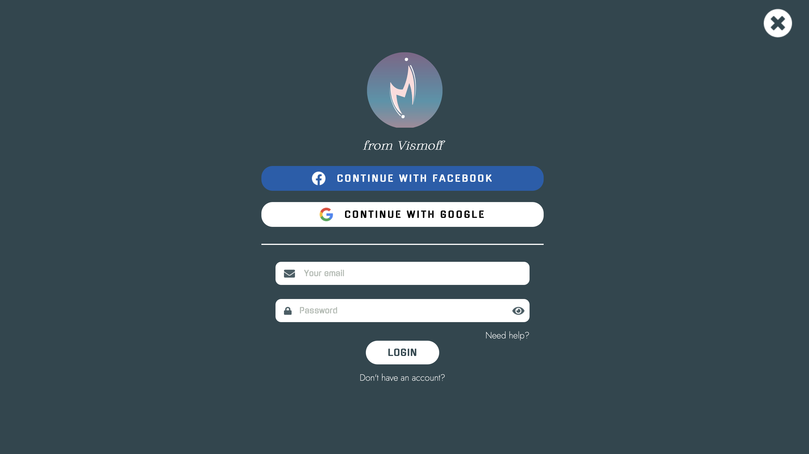
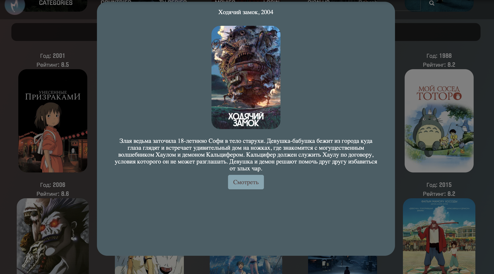
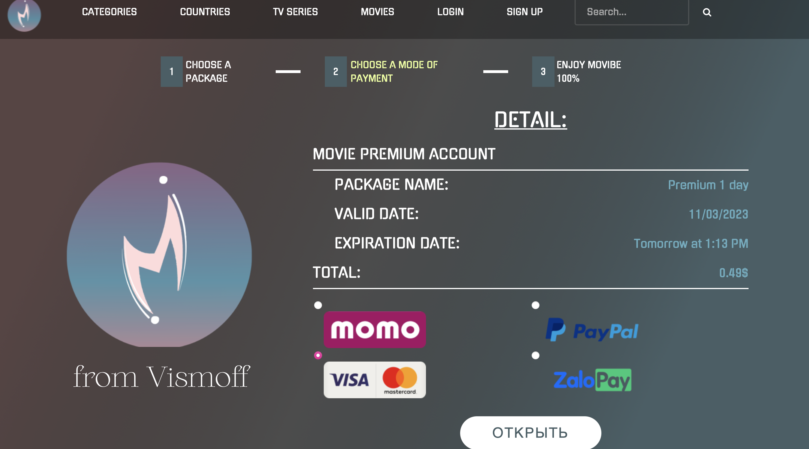
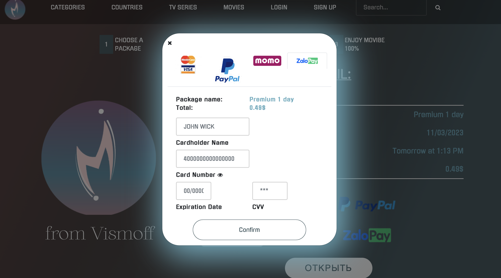

# JS-team-project

- First JS team project

`GitHub Pages link:` https://otter00.github.io/js-team-project/

## Subject:

- Movies

## Includes:

- API
- HTML/CSS/Sass/JS
- JS Validation
- JS Slider
- Payment modal window
- Browserify modules: moment (for datetime)
